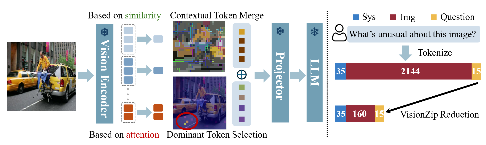

# VisionZip

Here, I reimplement a SoTA MLLMs acceleration method called VisionZip based on [LLaVA-1.5](https://github.com/haotian-liu/LLaVA) and [lmms-eval](https://github.com/EvolvingLMMs-Lab/lmms-eval). This implementation is based on the original [VisionZip](https://github.com/dvlab-research/VisionZip) repository. Compared to the original version, this version is more readable and clear by removing unnecessary code and adding specific comments. It should align with the original version.

## Authors

Senqiao Yang, Yukang Chen, Zhuotao Tian, Chengyao Wang, Jingyao Li, Bei Yu, Jiaya Jia


## Abstract

Recent advancements in vision-language models have enhanced performance by increasing the length of visual tokens, making them much longer than text tokens and significantly raising computational costs. However, we observe that the visual tokens generated by popular vision encoders, such as CLIP and SigLIP, contain significant redundancy. To address this, we introduce VisionZip, a simple yet effective method that selects a set of informative tokens for input to the language model, reducing visual token redundancy and improving efficiency while maintaining model performance. The proposed VisionZip can be widely applied to image and video understanding tasks and is well-suited for multi-turn dialogues in real-world scenarios, where previous methods tend to underperform. Experimental results show that VisionZip outperforms the previous state-of-theart method by at least 5% performance gains across nearly all settings. Moreover, our method significantly enhances model inference speed, improving the prefilling time by 8× and enabling the LLaVA-Next 13B model to infer faster than the LLaVA-Next 7B model while achieving better results. Furthermore, we analyze the causes of this redundancy and encourage the community to focus on extracting better visual features rather than merely increasing token length. Our code is available at https://github.com/dvlabresearch/VisionZip.



## Installation

First, clone this repository.

```
git clone https://github.com/Fanziyang-v/VisionZip.git
cd VisionZip
```

Second, create a virtual environment by conda.

```
conda create -n visionzip python=3.10 -y
conda activate visionzip
```

Third, install lmms-eval environment.

```
git clone https://github.com/EvolvingLMMs-Lab/lmms-eval.git
pip install -e lmms-eval
```

Fourth, install LLaVA environment.

```
git clone https://github.com/haotian-liu/LLaVA.git
pip install -e LLaVA/
```

To activate VisionZip support, we need to add few lines of code in [llava.py](./lmms-eval/lmms_eval/models/llava.py) file.

1. Add VisionZip arguments to LLaVA constructor function:
    ```
    def __init__(
        self,
        pretrained: str = "liuhaotian/llava-v1.5-7b",
        truncation: Optional[bool] = True,
        device: Optional[str] = "cuda:0",
        batch_size: Optional[Union[int, str]] = 1,
        model_name=None,
        attn_implementation=best_fit_attn_implementation,
        device_map="cuda:0",
        conv_template="vicuna_v1",
        use_cache=True,
        tie_weights: bool = True,
        truncate_context=False,  # whether to truncate the context in generation, set it False for LLaVA-1.6
        customized_config=None,  # ends in json
        # ! Visionzip Args
        dominant: Optional[int] = None,
        contextual: Optional[int] = None,
        // ......
    ```
2. Add VisionZip activation code.
    ```
    // ......
    self._config = self._model.config
    if dominant is not None and contextual is not None:
        # ! Activate Visionzip
        from visionzip import visionzip
        self._model = visionzip(self._model, dominant=dominant, contextual=contextual)
    // ......
    ```
